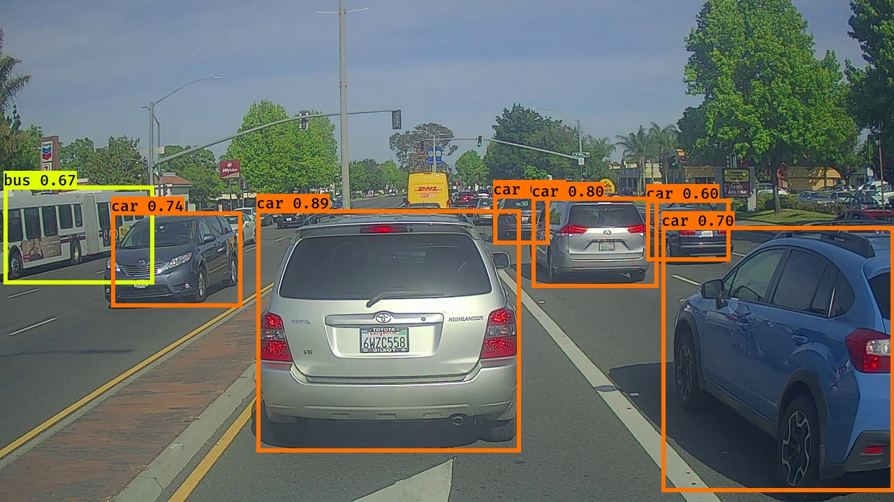

# Object-dectection-using-YoloV2
Given an image this will detect and classify objects using bounding boxes
# Results
Input image:

Outout image:

# Note
1. This project uses existing pretrained weights from the official YOLO website, and further processed using a function written by Allan Zelener.
2. Instructions to generate yolo.h5 file can be found here. Place that in model_data folder
3. Input images can be found in images directory. Corresponding output images can be found in out directory.
